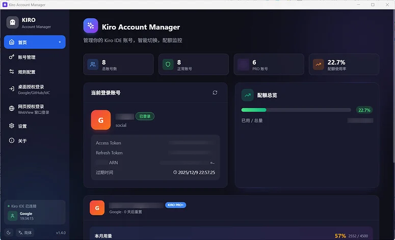
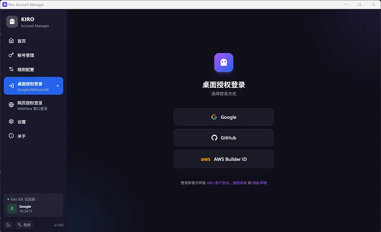
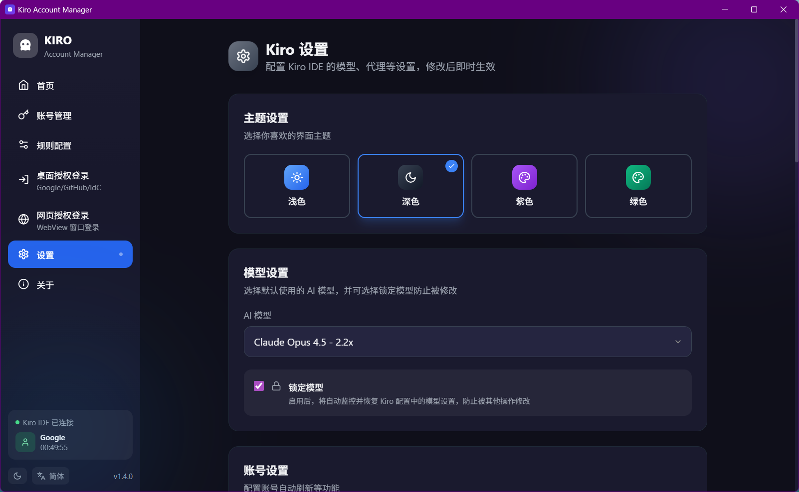

# Kiro Account Manager

  

  
  
  
  
  
  
  

  <b>🚀 智能管理 Kiro IDE 账号，一键切换，配额监控</b>

  🌐 <b><a href="https://kiro-website-six.vercel.app">官方网站</a></b> | 
  📥 <b><a href="#-下载">立即下载</a></b> | 
  💬 <b><a href="https://qm.qq.com/q/xi0AglEqGs">加入 QQ 2群</a></b>

> **📢 语言支持**：从当前版本开始，本项目**仅支持简体中文界面**，已移除英文和俄语翻译。这样可以简化维护，专注于功能开发。

---

## 💬 交流反馈

- 🐛 [提交 Issue](https://github.com/hj01857655/kiro-account-manager/issues)
- 💬 QQ 1群：[1020204332](https://qm.qq.com/q/Vh7mUrNpa8)
- 💬 QQ 2群：[1080919449](https://qm.qq.com/q/xi0AglEqGs)
- 💬 QQ 3群：[1076442194](https://qm.qq.com/q/3KYs28eAKQ)

---

## 📥 下载

**最新版本**：[v1.8.2](https://github.com/hj01857655/kiro-account-manager/releases/latest)

| 平台 | 架构 | 文件格式 | 下载链接 |
|------|------|---------|---------|
| 🪟 **Windows** | x64 | MSI 安装包 | [KiroAccountManager_1.8.2_x64_zh-CN.msi](https://github.com/hj01857655/kiro-account-manager/releases/download/v1.8.2/KiroAccountManager_1.8.2_x64_zh-CN.msi) |
| 🍎 **macOS** | Intel (x64) | DMG 镜像 | [KiroAccountManager_1.8.2_x64.dmg](https://github.com/hj01857655/kiro-account-manager/releases/download/v1.8.2/KiroAccountManager_1.8.2_x64.dmg) |
| 🍎 **macOS** | Apple Silicon (M1/M2/M3) | DMG 镜像 | [KiroAccountManager_1.8.2_aarch64.dmg](https://github.com/hj01857655/kiro-account-manager/releases/download/v1.8.2/KiroAccountManager_1.8.2_aarch64.dmg) |
| 🐧 **Linux** | x86_64 | AppImage | [KiroAccountManager_1.8.2_amd64.AppImage](https://github.com/hj01857655/kiro-account-manager/releases/download/v1.8.2/KiroAccountManager_1.8.2_amd64.AppImage) |
| 🐧 **Linux** | x86_64 | DEB 包 | [KiroAccountManager_1.8.2_amd64.deb](https://github.com/hj01857655/kiro-account-manager/releases/download/v1.8.2/KiroAccountManager_1.8.2_amd64.deb) |

**系统要求**：
- **Windows**: Windows 10/11 (64-bit)，需要 [WebView2](https://developer.microsoft.com/microsoft-edge/webview2/) (Win11 已内置)
- **macOS**: macOS 10.15+ (Catalina 及以上)
- **Linux**: x86_64 架构，需要 WebKitGTK 4.0+

**安装说明**：
- **Windows**: 双击 `.msi` 文件安装，首次运行可能需要安装 WebView2
- **macOS**: 打开 `.dmg` 文件，拖动应用到 Applications 文件夹，首次运行需要在「系统偏好设置 → 安全性与隐私」中允许
- **Linux AppImage**: 添加执行权限 `chmod +x KiroAccountManager_amd64.AppImage`，然后直接运行
- **Linux DEB**: 使用 `sudo dpkg -i KiroAccountManager_amd64.deb` 安装

---

## ✨ 核心功能

### 🔐 在线登录

**Social 登录** - 社交账号授权
- Google / GitHub
- 桌面端 OAuth 流程
- 自动刷新 Token

**IdC 登录** - AWS IAM Identity Center
- BuilderId（个人开发者账号）
- 🆕 Enterprise（企业账号）
- 完整支持 SSO OIDC 流程
- 企业账号专属徽章颜色

### 📊 账号管理

**多视图展示**
- 卡片视图 / 列表视图自由切换
- 配额进度条（主配额 / 试用 / 奖励）
- 订阅类型标识（Free / PRO / PRO+）
- Token 过期倒计时
- 状态高亮（正常 / 过期 / 封禁 / 当前使用）

**智能检测**
- 封禁检测（423 Locked / 403 TEMPORARILY_SUSPENDED）
- 默认按试用到期时间排序
- 刷新失败自动通知（封禁 / Token 失效）

### 🔄 一键切号

- 无感切换 Kiro IDE 账号
- 自动重置机器 ID（随机 / 绑定模式）
- 切换进度实时显示
- 封禁账号自动跳过

### 📦 批量操作

**导入导出**
- JSON 格式（文件导入 / 文本粘贴）
- 🆕 从 Kiro IDE 导入（自动检测已登录账号）
- 🆕 从 kiro-cli 导入（读取 SQLite 数据库）
  - macOS / Linux：可直接安装 `kiro-cli`（`curl -fsSL https://cli.kiro.dev/install | bash`）
  - Windows：需通过 WSL 使用 `kiro-cli`，数据库路径可填 `\\wsl$\<distro>\home\<user>\.local\share\kiro-cli\data.sqlite3`
- 导出为 JSON 文件（支持批量选择）

**批量管理**
- 批量刷新（智能并发控制，自动优化速度）
- 批量删除 / 批量打标签
- 🆕 远程删除（从 AWS 服务端注销，仅 Google/GitHub 且状态正常）
- 关键词搜索过滤

**性能优化**
- 🚀 后端减少不必要的内存克隆，提升响应速度
- 🚀 前端优化组件重渲染，筛选/搜索快 2-3 倍
- 🚀 使用 Map/Set 数据结构，查找性能提升至 O(1)

### 🏷️ 标签与分组

**标签系统**
- 自定义标签（名称 / 颜色）
- 批量设置标签
- 按标签筛选账号

**分组管理**
- 🆕 账号分组功能
- 按分组筛选账号
- 支持无分组 / 有分组筛选

### 🔍 高级筛选

- 按订阅类型筛选（Free / PRO / PRO+）
- 按状态筛选（正常 / 封禁）
- 按使用率 / 添加时间 / 试用到期排序
- 三态排序（降序 → 升序 → 取消）

### 🔌 Kiro 配置

**MCP 服务器管理**
- 增删改查 MCP 配置
- 启用 / 禁用服务器
- autoApprove 通配符支持（`*` / `tool_*` / 正则）
- 环境变量配置
- 实时连接状态检测

**Steering 规则管理**
- 4 种 inclusion 模式：
  - `always` - 始终包含
  - `auto` - 自动包含（关键词匹配）
  - `fileMatch` - 文件匹配时包含
  - `manual` - 手动引用（`#steering-name`）
- frontmatter 元数据（name / description / keywords）
- 文件引用支持（`#[[file:path]]`）
- Markdown 语法高亮编辑

**Skills 管理**（Kiro v0.9.2+）
- 浏览用户级和项目级 Skills
- 创建 / 编辑 / 删除 SKILL.md
- frontmatter 支持（name / description）
- 快速激活 / 停用

**Custom Agents 管理**（Kiro v0.9.2+）
- 完整 v0.10.32 schema 支持：
  - `name` / `description` - 基础信息
  - `tools` - 工具权限（read / write / shell / web / spec / mcp / *）
  - `model` - 指定 AI 模型
  - `includeMcpJson` - 包含 MCP 配置
  - `includePowers` - 包含 Powers
- 用户级（~/.kiro/agents/）和项目级（.kiro/agents/）
- JSON 编辑器（语法高亮 + 验证）

**Powers 管理**（Kiro v0.9.2+）
- 浏览已安装的 Powers
- 查看 POWER.md 文档
- 查看包含的 MCP 服务器配置
- 查看 Steering 文件列表
- 一键卸载 Power

**版本变化速览（Kiro）**
- **v0.9.2 引入**：Skills、Custom Agents（sub-agent 更名）、Powers registry-v2
- **v0.10.x 增强（含 v0.10.32）**：
  - Spec：Feature 双工作流（Requirements-First / Design-First）+ Bugfix 工作流（`bugfix.md -> design.md -> tasks.md`）
  - Supervised hunk 级审查（逐块接受/拒绝/讨论）
  - Task Hooks：Pre/Post Task Execution
  - MCP：Prompts / Resource Templates / Elicitation

**项目级配置支持**
- Skills / Steering / Custom Agents 同时支持：
  - 用户级：`~/.kiro/`（全局生效）
  - 项目级：`<project>/.kiro/`（仅当前项目）
- 自动检测并切换配置路径
- 项目级配置优先级更高

### ⚙️ 系统设置

**界面主题**
- 四种主题（浅色 / 深色 / 紫色 / 绿色）

**AI 配置**
- AI 模型选择与锁定
- 代码库索引开关
- 信任命令配置（关闭 / 常用 / 全部）
- 🆕 Agent 自主模式（监督 / 自动驾驶）

**账号管理**
- Token 自动刷新（可配置间隔）
- 切号自动重置机器 ID（随机 / 绑定模式）
- 隐私模式（邮箱脱敏显示）
- 🆕 余额不足自动换号（可配置阈值和检查间隔）

**浏览器与代理**
- 自定义浏览器 / 自动检测
- 默认无痕模式启动（保护隐私，简化 OAuth 流程）
- HTTP 代理配置 / 自动检测系统代理
- TUN 模式检测

### 🔑 机器码管理

- 查看 / 复制 / 重置
- 支持 Windows / macOS / Linux

### 🖥️ IDE 集成

- 检测 Kiro IDE 运行状态
- 一键启动 / 关闭
- 自动同步代理和模型设置

---

## 📸 截图

---

## ❓ 常见问题

**Q: 切换账号时提示 "bearer token invalid"**

A: Token 过期了，切换前先点「刷新」按钮。这是 Kiro 服务端返回的错误，不是管理器的问题。

**Q: 刷新 Token 失败**

A: 网络超时，手动再刷新一次或换个网络试试。

---

## 📝 源码说明

本仓库不再提供源码，仅用于发布 Release 和展示项目信息。

**⚠️ 本项目永久免费！如果有人向你收费，你被骗了！**

---

## 💖 赞助

如果这个项目对你有帮助，可以请作者喝杯咖啡 ☕

  
  

---

## ⭐ Star History

---

## 📄 许可证

[CC BY-NC-SA 4.0](LICENSE) - **禁止商业使用**

## ⚠️ 免责声明

本软件仅供学习交流使用，**严禁商业用途**。使用本软件所产生的任何后果由用户自行承担。

---

Made with ❤️ by hj01857655

